# Event-Driven Payment Gateway — Architecture & Design

**Stack:** Java 21, Spring Boot 3.3, Spring Cloud Gateway, Spring Kafka, Apache Kafka, PostgreSQL, Redis
**Target scale:** 10,000,000 transactions/minute (design target — see §2 for what this means and how the local reference implementation relates to it)

---

## 1. What "10M transactions/minute" actually means

10,000,000 / min = **166,667 TPS sustained**. Real-world card networks (Visa's publicly cited peak capacity is roughly 65,000 TPS) run below this number, so a design that targets 166K TPS sustained — with headroom for 2-3x bursts (~400-500K TPS) — is not a "just add more pods" problem. It is a partitioning, data-storage, and organizational problem as much as a Spring Boot problem.

This document is split into two layers on purpose:

1. **The architecture and patterns** (this document) — correct at any scale, and what actually gets reused as you grow.
2. **The reference implementation** (the code in this repo) — a fully wired, runnable-on-a-laptop skeleton that demonstrates every pattern (outbox, idempotent consumers, choreographed saga, event sourcing) correctly, at a scale of maybe a few hundred TPS on a single machine.
3. **The production scale-out path** (`SCALING.md`) — the specific infrastructure changes (partition counts, broker counts, sharding, Avro, autoscaling) that take the same architecture from "correct" to "166K+ TPS."

Nothing in the reference code needs to be *rewritten* to scale — it needs to be *re-deployed* with different partition counts, more consumer replicas, a sharded datastore, and Avro instead of JSON. That property is the actual design goal.

---

## 2. High-level architecture

```mermaid
flowchart LR
    Client([Client / Merchant]) --> GW[API Gateway<br/>Spring Cloud Gateway]
    GW --> ING[Payment Ingestion Service]
    ING -->|writes Payment + OutboxEvent<br/>in one DB transaction| PG1[(Postgres:<br/>ingestion-db)]
    ING -.outbox poller.-> K1[["Kafka:<br/>payment.initiated"]]

    K1 --> FRAUD[Fraud Detection Service]
    FRAUD --> K2[["Kafka:<br/>payment.fraud.checked"]]

    K2 --> AUTH[Authorization Service]
    AUTH -->|simulated issuer/network call| ISSUER[(Issuer / Card Network<br/>simulator)]
    AUTH --> K3[["Kafka:<br/>payment.authorized"]]

    K3 --> LEDGER[Ledger Service<br/>event-sourced]
    LEDGER --> PG2[(Postgres:<br/>ledger-db)]
    LEDGER --> K4[["Kafka:<br/>payment.ledger.updated"]]

    K4 --> SETTLE[Settlement Service]
    SETTLE --> K5[["Kafka:<br/>payment.settled"]]

    K3 --> NOTIFY[Notification Service]
    K5 --> NOTIFY
    NOTIFY --> WEBHOOK([Merchant webhook / email])

    REDIS[(Redis Cluster:<br/>idempotency + rate limit)] -.-> GW
    REDIS -.-> ING
    REDIS -.-> FRAUD
```

This is a **choreographed saga**: each service reacts to the previous service's event and emits its own, rather than a central orchestrator calling each step. Choreography scales better (no orchestrator bottleneck, no single point of coordination) at the cost of harder-to-trace business processes — mitigated below with a mandatory `traceId` on every event and distributed tracing.

### Why choreography over orchestration here

An orchestrator (e.g., a `PaymentSagaOrchestrator` service holding a state machine) is easier to reason about and is the right call for a lower-throughput system with complex branching. At 166K+ TPS, the orchestrator itself becomes a hot path every transaction must pass through, and its state store becomes the bottleneck. Choreography lets each stage scale independently by adding partitions/consumers to just the stage that's under load (fraud checks are usually the slowest stage — CPU-bound rules/ML — so it gets more partitions and more consumer replicas without touching the rest of the pipeline).

If your actual business process has deep branching (retries, manual review queues, multi-party approvals), a hybrid is common in production: choreography for the linear happy path, with a lightweight orchestrator service (also Kafka-driven, via a `payment.saga.state` compacted topic) that only gets involved for exception flows (fraud hold, manual review, chargebacks).

---

## 3. Microservices

| Service | Responsibility | Consumes | Produces | Store |
|---|---|---|---|---|
| **api-gateway** | Auth, TLS termination, rate limiting, routing | HTTP | HTTP | — |
| **payment-ingestion-service** | Validate request, assign `paymentId`, enforce idempotency, durably record intent (outbox) | HTTP | `payment.initiated` | Postgres (sharded by `accountId` at scale) |
| **fraud-detection-service** | Velocity checks, rule engine, (optionally) ML model scoring | `payment.initiated` | `payment.fraud.checked` | Redis (velocity counters), read-only feature store |
| **authorization-service** | Call issuer/card network (simulated here), get approve/decline | `payment.fraud.checked` | `payment.authorized` | none (stateless) — optionally a call-log table |
| **ledger-service** | Double-entry bookkeeping, source of truth for money movement | `payment.authorized` | `payment.ledger.updated` | Postgres, event-sourced (`ledger_entry` append-only table) |
| **settlement-service** | Batches authorized+ledgered payments per merchant, drives payout/settlement cycles | `payment.ledger.updated` | `payment.settled` | Postgres (settlement batches) |
| **notification-service** | Webhooks/emails to merchants and cardholders | `payment.authorized`, `payment.fraud.checked` (declines), `payment.settled` | — (external HTTP/email) | none (stateless) |

Each service is an independent Spring Boot application, independently deployable, independently scalable, with its own datastore (database-per-service) — no service reaches into another service's tables.

---

## 4. Kafka topic design

| Topic | Key | Why this key | Compaction |
|---|---|---|---|
| `payment.initiated` | `accountId` | Preserves per-account event ordering (a customer's payments process in order); spreads load across partitions by account | No (retain 7d) |
| `payment.fraud.checked` | `accountId` | Same ordering guarantee downstream | No (retain 7d) |
| `payment.authorized` | `accountId` | Same | No (retain 7d) |
| `payment.ledger.updated` | `merchantId` | Settlement batches per merchant; re-keying here is intentional (see below) | No (retain 30d — financial audit trail) |
| `payment.settled` | `merchantId` | Notification/reporting consumers read per-merchant | No (retain 90d) |
| `payment.dlq.*` | same as source | One DLQ topic per stage, for messages that fail after retry | No (retain 30d) |

**Re-keying at the ledger boundary:** `payment.initiated` → `payment.authorized` are keyed by `accountId` (the payer) so a single customer's transactions stay ordered through fraud/auth. `payment.ledger.updated` → `payment.settled` are re-keyed by `merchantId` (the payee) because settlement is inherently a per-merchant batching operation. Re-keying means a repartition (the ledger-service producer writes with a new key), which is intentional and cheap compared to trying to force one key through the whole pipeline.

**Partition count** is chosen per-topic based on target throughput ÷ realistic per-partition throughput (detailed math in `SCALING.md` — reference deployment here uses low partition counts like 6-12 for local dev; production sizing is 200-500+ per hot topic).

**Producer configuration** (all services): `acks=all`, `enable.idempotence=true`, `compression.type=lz4`, `linger.ms=5-20` (batch for throughput), `max.in.flight.requests.per.connection=5` (safe with idempotence on). Transactional producers (`transactional.id`) are used in `payment-ingestion-service`'s outbox publisher and anywhere a service both consumes and produces (read-process-write) to get exactly-once semantics across the Kafka boundary.

**Consumer configuration:** `isolation.level=read_committed` everywhere (so nobody reads uncommitted/aborted transactional writes), manual/`AckMode.MANUAL` acknowledgment tied to successful DB commit, `max.poll.records` tuned per service (fraud rules are CPU-heavier → lower value; notification is I/O-bound → can be higher with async fan-out).

---

## 5. Correctness patterns under high concurrency

### 5.1 Transactional outbox (payment-ingestion-service)
A payment request must never be accepted by the API and then lost before reaching Kafka. The ingestion service writes the `Payment` row and an `OutboxEvent` row in the **same local DB transaction**. A separate poller (or, at scale, Debezium CDC off the outbox table) reads unpublished outbox rows and publishes them to Kafka, marking them sent. This avoids the classic dual-write bug (DB commit succeeds, Kafka publish fails, event is silently lost).

### 5.2 Idempotency
- **At the edge:** clients supply an `Idempotency-Key` header; `payment-ingestion-service` enforces a unique constraint on `(accountId, idempotency_key)` — a retried request returns the original result instead of double-charging.
- **At every consumer:** each service keeps a `processed_events` table (or Redis `SETNX` with TTL for lower-latency stages) keyed by `eventId`, and checks-and-inserts inside the same transaction as its business write. Kafka's at-least-once delivery means every consumer *will* see duplicates during rebalances/retries; idempotent consumers make that safe.

### 5.3 Exactly-once where it matters
Money-movement is the one place in this pipeline where "at least once" is not good enough. Getting true atomicity across three different resources — the Kafka offset for the inbound `payment.authorized` record, the Postgres write of the double-entry ledger rows, and the Kafka publish of the outbound `payment.ledger.updated` — is a distributed transaction. Rather than reaching for XA/2PC (operationally painful, and still not free of edge cases), `ledger-service` uses the **same transactional-outbox pattern as ingestion**, applied to a consume-process-produce hop instead of an HTTP-triggered one:

1. A `processed_events` table records the inbound event's `eventId` with a unique constraint — this is the consumer-side idempotency check from §5.2.
2. In one local Postgres transaction: insert the `processed_events` row, insert the debit + credit `ledger_entry` rows, and insert an `outbox_events` row for the `payment.ledger.updated` event. All four inserts commit together or not at all.
3. The Kafka offset for the inbound record is only acknowledged *after* that transaction commits (manual ack mode) — so a crash between "DB committed" and "offset acknowledged" simply redelivers the message, which the `processed_events` unique constraint turns into a safe no-op.
4. The same outbox-poller pattern from ingestion (§5.1) publishes the queued `payment.ledger.updated` row to Kafka.

This gets the same effective guarantee as a cross-resource transaction (a ledger entry is written if and only if it will eventually produce exactly one `payment.ledger.updated` event) using only Postgres's native transactionality — no XA coordinator required.

### 5.4 Ordering vs. parallelism
Kafka only guarantees ordering *within a partition*. Keying by `accountId` means one customer's events are ordered, but different customers' events are processed in parallel across partitions — which is exactly the trade-off a payment system wants (never reorder one customer's payments; don't force a global order across unrelated customers).

### 5.5 Backpressure & failure isolation
- Each stage has a **DLQ topic** (`payment.dlq.fraud`, `payment.dlq.auth`, ...) via Spring Kafka's `DefaultErrorHandler` + `DeadLetterPublishingRecoverer`, with exponential backoff retry (e.g., 3 retries, 1s/5s/30s) before parking a message.
- Circuit breakers (Resilience4j) wrap the simulated issuer call in `authorization-service` so a slow downstream doesn't stall the whole consumer group.
- Consumer lag (per partition, per group) is the primary autoscaling signal (see `SCALING.md`).

---

## 6. Data storage strategy

- **Database-per-service.** No shared schema, no cross-service joins. Services communicate only via Kafka events or, rarely, synchronous REST for read-only lookups that can't wait for eventual consistency.
- **Ledger is append-only / event-sourced.** `ledger_entry` rows are never updated or deleted — corrections are new offsetting entries, which is both an accounting requirement (auditability) and a concurrency-friendly pattern (no lock contention on updates).
- **CQRS for reads.** Merchant-facing "transaction status" queries don't hit the write-path databases; a separate read-optimized projection (materialized view or a search index, updated by consuming the same Kafka topics) serves queries. This is called out in the reference code's `notification-service` extension points but not fully built out (see "Not built" below).

---

## 7. Observability

- **Distributed tracing:** every event carries a `traceId`/`spanId` in its envelope (`EventEnvelope`, see `common-events`), propagated via OpenTelemetry across HTTP and Kafka hops. One `traceId` lets you follow a single payment through all seven services in Jaeger/Tempo.
- **Metrics:** Micrometer → Prometheus on every service (`/actuator/prometheus`); key SLIs are consumer lag per topic/partition, p99 end-to-end latency (ingestion → authorized), fraud/decline rates, outbox publish lag.
- **Logging:** structured JSON logs, correlation via `traceId`, shipped to a central store (ELK/Loki).

---

## 8. What this reference implementation deliberately does NOT include

Being upfront about scope: this is a **correct, runnable skeleton that demonstrates the patterns**, not a certified payment processor. Notably absent (called out here rather than silently skipped):

- PCI-DSS scope reduction (tokenization vault, HSM-backed key management) — a real gateway never stores raw PANs; it would sit behind a tokenization service.
- A real issuer/network integration — `authorization-service` simulates approve/decline deterministically.
- Full CQRS read-side / materialized query service.
- Schema Registry + Avro (reference code uses JSON for readability; `SCALING.md` covers why Avro is mandatory at target scale).
- Multi-region active-active deployment.
- Chargebacks/disputes flow.

These are exactly the pieces you'd scope into subsequent phases — see the phased build plan below.

---

## 9. Phased build plan

1. **Phase 0 (this repo):** Single-region, choreographed saga, JSON events, single Postgres/Kafka instance, correctness patterns proven (outbox, idempotency, exactly-once ledger writes).
2. **Phase 1:** Avro + Schema Registry, DLQs + retry topics wired into alerting, Kafka Streams-based fraud rule engine, load testing to find real per-partition throughput.
3. **Phase 2:** Database sharding (ledger + ingestion by `accountId` hash), Kafka cluster sized per `SCALING.md`, consumer autoscaling on lag (KEDA), read-side CQRS projection.
4. **Phase 3:** Multi-region active-active, PCI tokenization vault, chaos testing, full DR runbooks.

See `SCALING.md` for the concrete numbers (partitions, brokers, shard counts) behind Phases 1-3.
